# 🏋️‍♂️ GRITER

## **0️⃣ 프로젝트 개요**

🎈 프로젝트명 : 그리터(GRITER)

📌 프로젝트 컨셉 : 커뮤니티 기능과 운동 및 식단 정보 기록을 통해 건강 관리를 도와주는 서비스

🛠 개발 기간 : 23.05.18 ~ 23.05.25 (8일)

🧑🏻 팀원 : 박재민, 조윤상

💻 사용 기술스택

         

## **1️⃣ 프로젝트 일정**

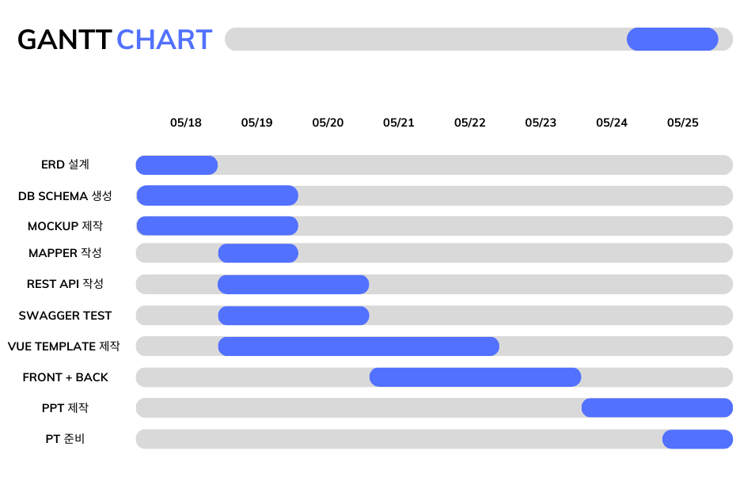

## **2️⃣ 팀원 정보 및 업무 분담 내역**

| 이름   | 역할 | 설명           |
| ------ | ---- | -------------- |
| 박재민 | FE && BE    | Vue Component 설계 및 프론트엔드 구현 + 백엔드 검토 |
| 조윤상 | BE && FE  | SpringBoot REST API 설계 및 백엔드 구현 + 프론트엔드 검토 |

## **3️⃣ UI 디자인 및 프로토타입**

* 로그인

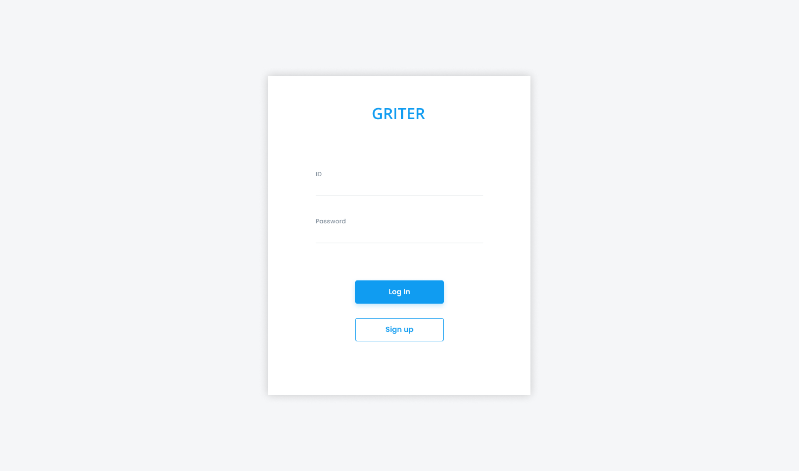

* 회원가입


* 홈페이지

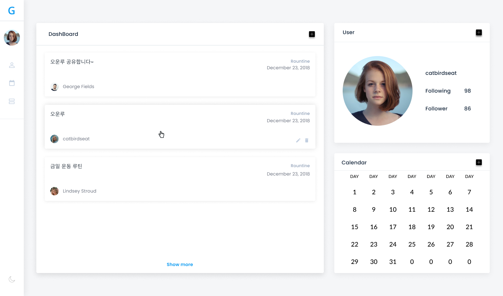

* 게시판

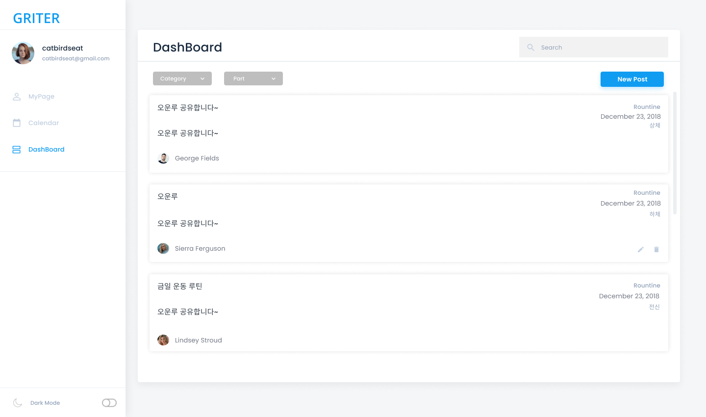

* 글 등록

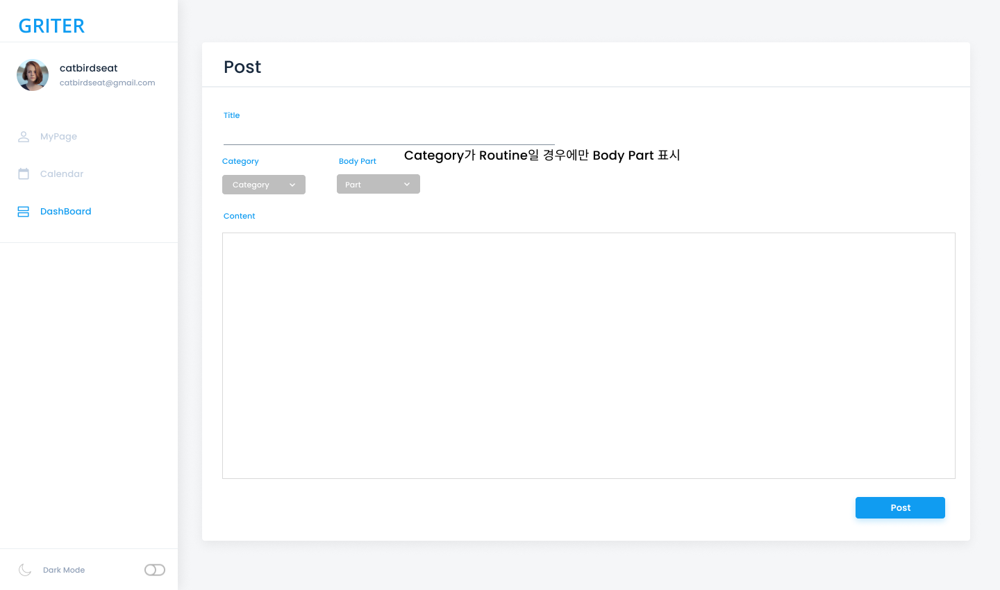

* 글 상세

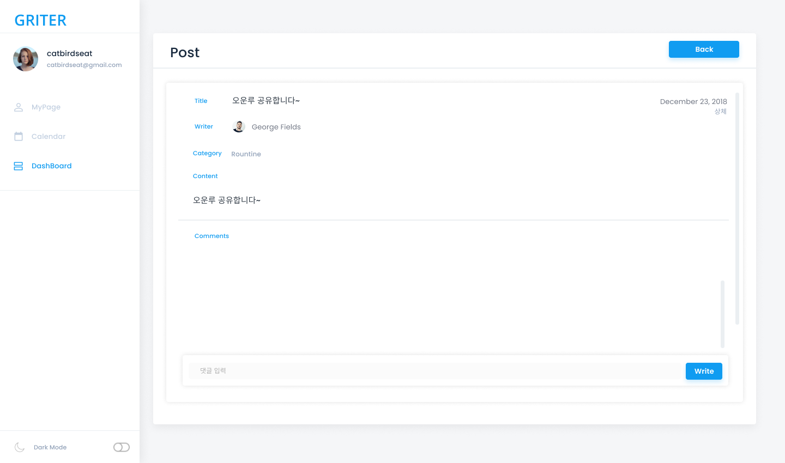

* 마이 페이지

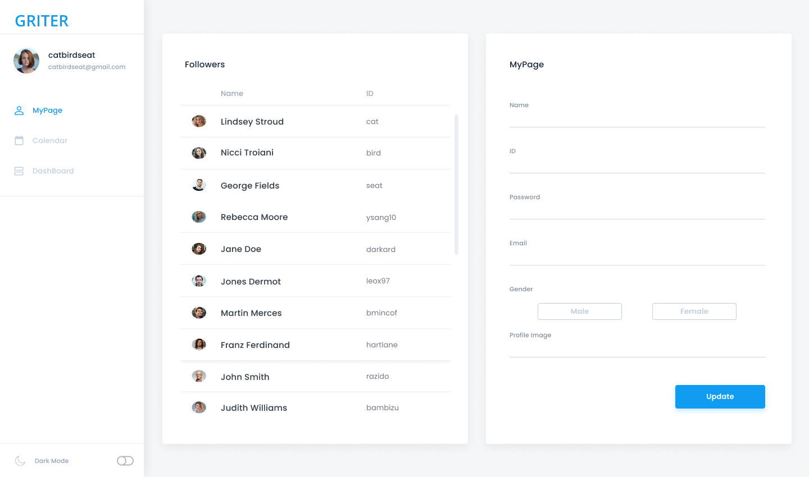

* 달력

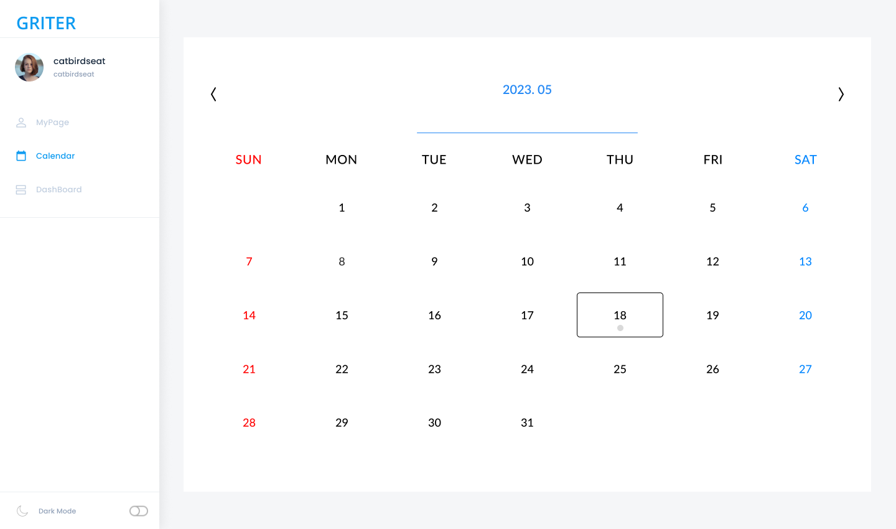
<br>

<!--## **3️⃣ 목표 서비스 구현 및 실제 구현 정도** -->

## **4️⃣ 서비스 명세서**
- [API 명세서](https://circular-ear-098.notion.site/63605c790ee94654a969fbd19b5dc299?v=a80ec7fc2ccf42888ef39c8d1050ee3e)

## **5️⃣ 데이터베이스 모델링 (ERD)**
  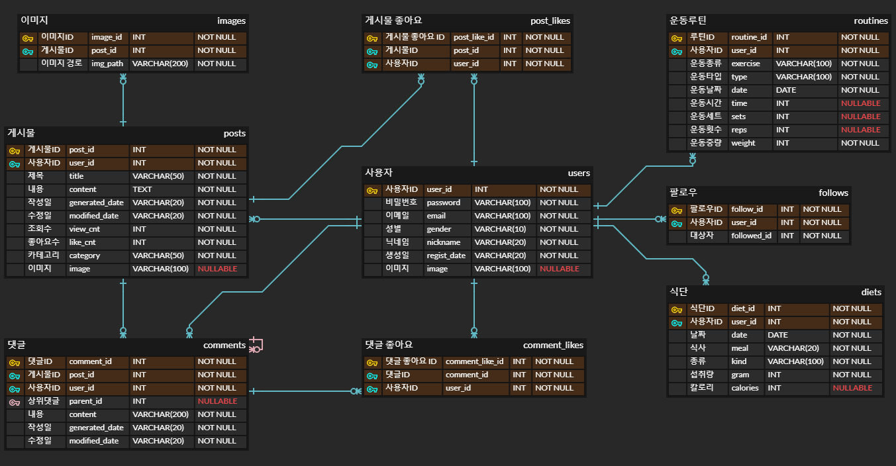

## **6️⃣ 컴포넌트 구조**

📱 FrontEnd
```javascript
📄 .gitignore
📄 babel.config.js
📄 jsconfig.json
📄 package-lock.json
📄 package.json
📄 README.md
📄 vue.config.js
📂 node_modules
📂 public
    ㄴ📄 favicon.ico
    ㄴ📄 index.html
📂 src
    ㄴ📄 App.vue
    ㄴ📄 main.js
    ㄴ📂 assets
    ㄴ📂 components
    	ㄴ📄 HomeContent.vue
    	ㄴ📂 cals
	    ㄴ📄 CalCreate.vue
	    ㄴ📄 CalDetail.vue
	    ㄴ📄 CalDietCreate.vue
	    ㄴ📄 CalDietDetail.vue
	    ㄴ📄 CalList.vue
	ㄴ📂 common
	    ㄴ📄 AsideNav.vue
	ㄴ📂 posts
	    ㄴ📄 PostsCreate.vue
	    ㄴ📄 PostsDetail.vue
	    ㄴ📄 PostsList.vue
	ㄴ📂 users
	    ㄴ📄 UsersInfo.vue
	    ㄴ📄 UsersLogin.vue
	    ㄴ📄 UsersModify.vue
	    ㄴ📄 UsersRegister.vue
	    ㄴ📄 UsersSearch.vue
    ㄴ📂 router
    	ㄴ📄 index.js
    ㄴ📂 store
        ㄴ📄 store.js
	ㄴ📂 modules
	    ㄴ📄 commentModule.js
	    ㄴ📄 dietModule.js
	    ㄴ📄 followModule.js
	    ㄴ📄 nightmodeModule.js
	    ㄴ📄 postModule.js
	    ㄴ📄 routineModule.js
	    ㄴ📄 userModule.js
    ㄴ📂 util
        ㄴ📄 http-common.js
    ㄴ📂 views
    	ㄴ📄 CalView.vue
	ㄴ📄 HomeView.vue
	ㄴ📄 PostsView.vue
	ㄴ📄 UserView.vue
```
💾 BackEnd
```java
📂 src/main/java
	ㄴ📦 com.griter
		ㄴ📄 GriterApiApplication.java
	ㄴ📦 com.griter.config
		ㄴ📄 DBConfig.java
		ㄴ📄 SwaggerConfig.java
		ㄴ📄 WebConfing.java
	ㄴ📦 com.griter.controller
		ㄴ📄 CommentLikeRestController.java		
		ㄴ📄 CommentRestController.java			
		ㄴ📄 DietRestController.java		
		ㄴ📄 FollowRestController.java		
		ㄴ📄 ImageRestController.java
		ㄴ📄 PostLikeRestController.java		
		ㄴ📄 PostRestController.java
    		ㄴ📄 RoutineRestController.java
		ㄴ📄 UserRestController.java
	ㄴ📦 com.griter.exception
		ㄴ📄 PostNotFoundException.java
	ㄴ📦 com.griter.interceptor
		ㄴ📄 JwtInterceptor.java
	ㄴ📦 com.griter.model.dao
	    	ㄴ📄 CommentDao.java
		ㄴ📄 CommentLikeDao.java
		ㄴ📄 DietDao.java
		ㄴ📄 FollowDao.java
		ㄴ📄 ImageDao.java
		ㄴ📄 PostDao.java
		ㄴ📄 PostLikeDao.java
		ㄴ📄 RoutineLikeDao.java
		ㄴ📄 UserDao.java
    	ㄴ📦 com.griter.model.dto
   	   	ㄴ📄 Comment.java
		ㄴ📄 CommentLike.java
		ㄴ📄 Diet.java
		ㄴ📄 Follow.java
		ㄴ📄 Image.java
		ㄴ📄 Post.java
		ㄴ📄 PostLike.java
		ㄴ📄 Routine.java
		ㄴ📄 User.java
    	ㄴ📦 com.griter.model.service
		ㄴ📄 CommentLikeService.java
		ㄴ📄 CommentLikeServiceImpl.java
		ㄴ📄 CommentService.java
		ㄴ📄 CommentServiceImpl.java
		ㄴ📄 DietService.java
		ㄴ📄 DietServiceImpl.java
		ㄴ📄 FollowService.java
		ㄴ📄 FollowServiceImpl.java
		ㄴ📄 ImageService.java
   	   	ㄴ📄 ImageServiceImpl.java
		ㄴ📄 PostLikeService.java
		ㄴ📄 PostLikeServiceImpl.java
		ㄴ📄 PostService.java
		ㄴ📄 PostServiceImpl.java
		ㄴ📄 RoutineService.java
		ㄴ📄 RoutineServiceImpl.java
		ㄴ📄 UserService.java
		ㄴ📄 UserServiceImpl.java
📂 src/main/resources
	ㄴ📂 mappers
		ㄴ📄 Comment.xml
		ㄴ📄 CommentLike.xml
		ㄴ📄 Diet.xml
		ㄴ📄 Follow.xml
		ㄴ📄 Image.xml
		ㄴ📄 Post.xml
		ㄴ📄 PostLike.xml
		ㄴ📄 Routine.xml
		ㄴ📄 User.xml
	ㄴ📄 application.properties
	ㄴ📄 schema.sql
📄 pom.xml
```
<br>

## **7️⃣ 서비스 대표 기능 및 실제 구현 화면**

* 홈페이지

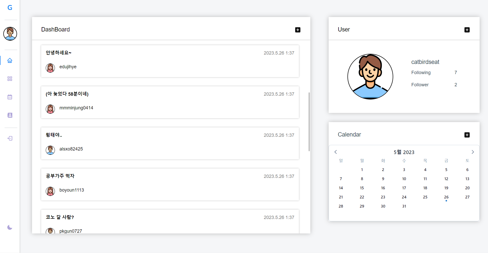

* 사용자 정보

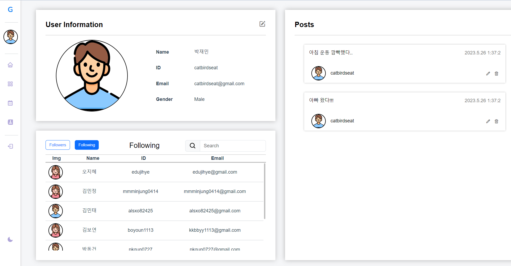

* 커뮤니티

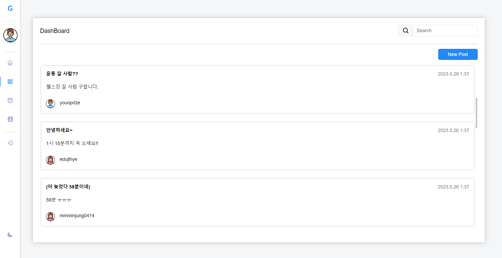

* 게시물 상세

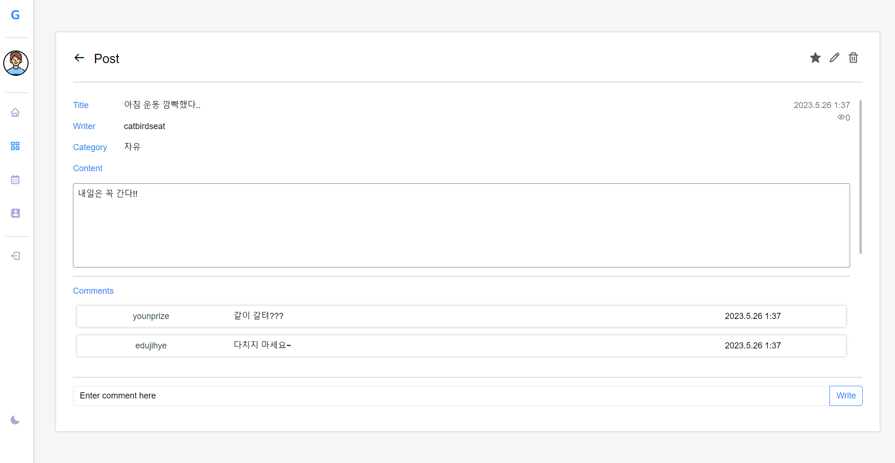

* 캘린더

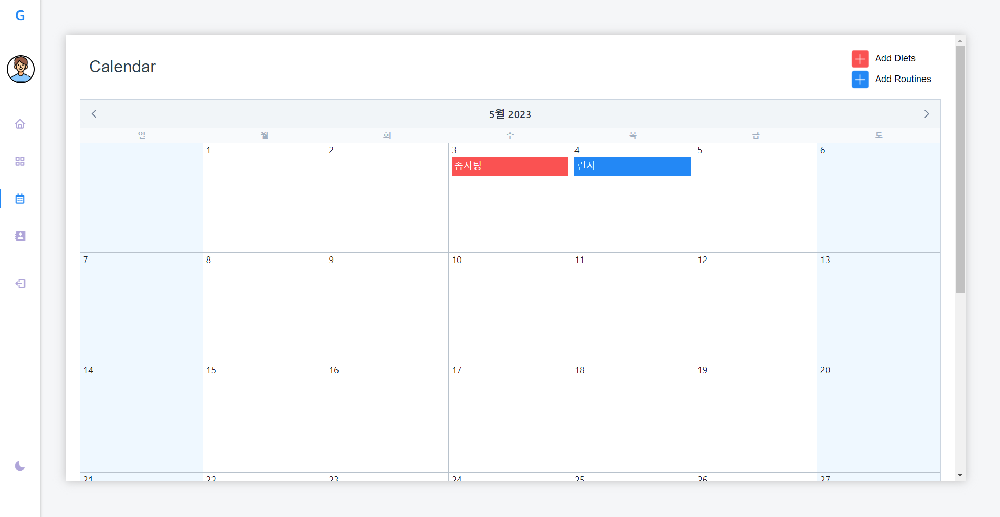

* 사용자 검색

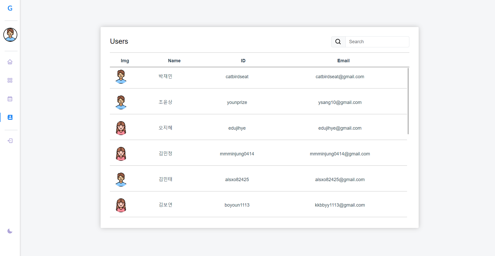

<br>

## **8️⃣ 기타 (느낀 점 및 후기)**

😎 박재민

- 저번 CRUD 때 백엔드를 맡았어서 이번엔 프론트를 맡아서 했다.

- 하지만 vue에 대한 이해도가 너무 적은 상태로 시작했다.
- 계란으로 바위치기하는 듯 해서 머리가 깨질듯 했지만 프로젝트가 끝나니 스스로 꽤 많이 성장한걸 느낄 수 있었다.
- 역시 인생은 실전이다.
- 프로젝트 기간동안 같이 잠도 못자고 열심히 해준 윤상이형한테 고맙다.


😜 조윤상

* REST API 설계 및 구현은 크게 어렵지 않았으나, DB 설계 시, 어려움을 느꼈습니다.
* Vue.js, Html, Css 의 길은 멀고도 험하다는 것을 깨달았습니다.
* 항상 '할 수 있다'는 동기부여를 해주고 긍정적인 마음가짐을 지닌 Pair 재민이에게 항상 감사합니다!!
